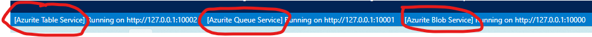

# funcps-powerbi


The most basic Durable Functions app contains three functions:

- Orchestrator function - describes a workflow that orchestrates other functions.
- Activity function - called by the orchestrator function, performs work, and optionally returns a value.
- Client function - a regular Azure Function that starts an orchestrator function. This example uses an HTTP triggered function.

## Disclaimer

**THE SOFTWARE IS PROVIDED "AS IS", WITHOUT WARRANTY OF ANY KIND, EXPRESS OR IMPLIED, INCLUDING BUT NOT LIMITED TO THE WARRANTIES OF MERCHANTABILITY, FITNESS FOR A PARTICULAR PURPOSE AND NONINFRINGEMENT. IN NO EVENT SHALL THE AUTHORS OR COPYRIGHT HOLDERS BE LIABLE FOR ANY CLAIM, DAMAGES OR OTHER LIABILITY, WHETHER IN AN ACTION OF CONTRACT, TORT OR OTHERWISE, ARISING FROM, OUT OF OR IN CONNECTION WITH THE SOFTWARE OR THE USE OR OTHER DEALINGS IN THE SOFTWARE.**

## Prerequisites

- [Azure CLI](https://docs.microsoft.com/en-us/cli/azure/install-azure-cli)
- Azure subscription & resource group
- [Azure Function Core Tools](https://docs.microsoft.com/en-us/azure/azure-functions/functions-run-local)
- [Azurite Extension for VS Code](https://marketplace.visualstudio.com/items?itemName=Azurite.azurite)
- [PowerShell Core](https://docs.microsoft.com/en-us/powershell/scripting/install/installing-powershell-core-on-windows?view=powershell-7.1)
- [.NET](https://dotnet.microsoft.com/en-us/download)

## Run Locally

Make sure the `Azurite` extension is running. Azure Functions must have Storage Account access to run locally.

Click on the `Azurite Table Service` label at the bottom of VS Code. Do the same for `Azurite Queue Service` and `Azurite Blob Service`.



Run the Durable Functions app locally:

```
func start
```

```
curl -X POST http://localhost:7071/api/orchestrators/PowerBiWorkspaceOrchestrator
```

## Deploy to Azure

```
func azure functionapp publish funcpsusscdev
```

## Links

- [Azure Durable Functions](https://learn.microsoft.com/en-us/azure/azure-functions/durable/durable-functions-overview?tabs=powershell)
