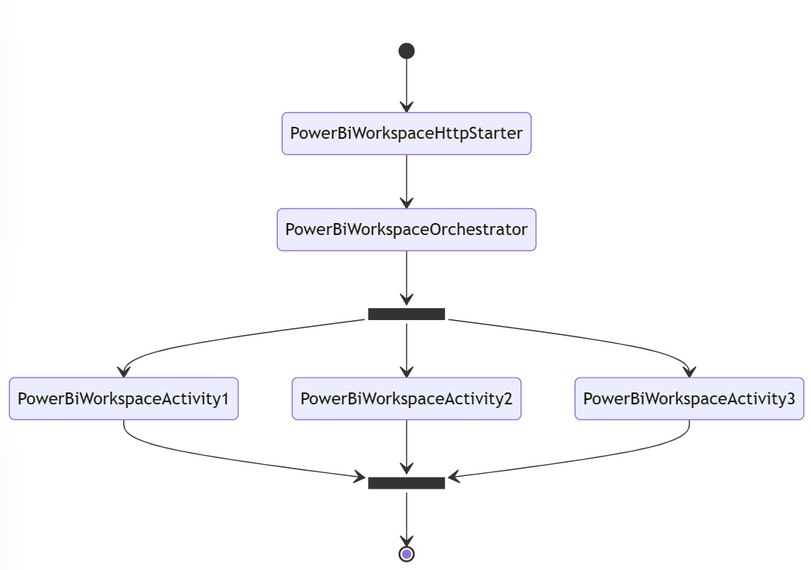

# funcps-powerbi




The most basic Durable Functions app contains three functions:

- Orchestrator function - describes a workflow that orchestrates other functions.
- Activity function - called by the orchestrator function, performs work, and optionally returns a value.
- Client function - a regular Azure Function that starts an orchestrator function. This example uses an HTTP triggered function.

## Disclaimer

**THE SOFTWARE IS PROVIDED "AS IS", WITHOUT WARRANTY OF ANY KIND, EXPRESS OR IMPLIED, INCLUDING BUT NOT LIMITED TO THE WARRANTIES OF MERCHANTABILITY, FITNESS FOR A PARTICULAR PURPOSE AND NONINFRINGEMENT. IN NO EVENT SHALL THE AUTHORS OR COPYRIGHT HOLDERS BE LIABLE FOR ANY CLAIM, DAMAGES OR OTHER LIABILITY, WHETHER IN AN ACTION OF CONTRACT, TORT OR OTHERWISE, ARISING FROM, OUT OF OR IN CONNECTION WITH THE SOFTWARE OR THE USE OR OTHER DEALINGS IN THE SOFTWARE.**

## Prerequisites

- [Azure CLI](https://docs.microsoft.com/en-us/cli/azure/install-azure-cli)
- Azure subscription & resource group
- [Azure Function Core Tools](https://docs.microsoft.com/en-us/azure/azure-functions/functions-run-local)
- [Azure Storage Emulator](https://docs.microsoft.com/en-us/azure/storage/common/storage-use-emulator)

## Deployment

```
func azure functionapp publish funcpsusscdev
```

```
func start
```

```
curl -X POST http://localhost:7071/api/orchestrators/PowerBiWorkspaceOrchestrator
```

## Links

- [Azure Durable Functions](https://learn.microsoft.com/en-us/azure/azure-functions/durable/durable-functions-overview?tabs=powershell)
